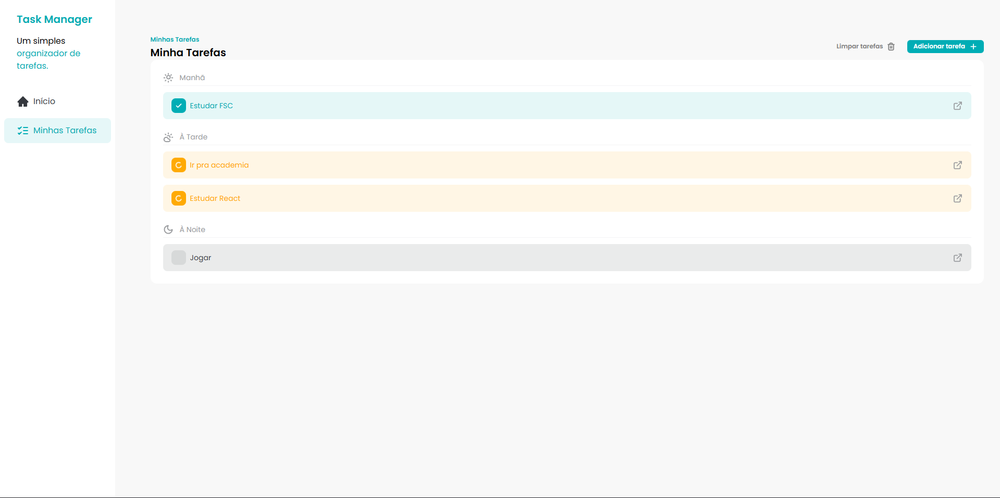

# 🖥️ Como está ficando (Desktop)

<div>
    
</div>

---

https://alunos.fullstackclub.com.br/area/produto/item/3576435

---

# 📦 Comandos Utilizados

```
npm install uuid@10.0.0
```

## 🏗️ Inicialização do Projeto

```bash
npm create vite@5.2.0 fsc-task-manager -- --template react
```

# 🧹 ESLint

```bash
npx eslint --init
npm install -D eslint-config-prettier
npm install -D eslint-plugin-simple-import-sort@12.1.0
```

# 🎨 Prettier

```bash
npm install -D prettier
npm install -D prettier-plugin-tailwindcss@0.6.5
npx prettier --write src
```

# 🧰 Husky + Lint Staged + Commit Linter

```bash
npm i -D husky
npm install --save-dev lint-staged
npm install git-commit-msg-linter --save-dev
```

# 💅 TailwindCSS + PostCSS + Autoprefixer

```bash
npm install -D tailwindcss@3.4.4 postcss@8.4.38 autoprefixer@10.4.19
npx tailwindcss init -p
```

# 🖼️ SVG com SVGR

```bash
npm install -D vite-plugin-svgr@4.2.0
```

# 🔔 Biblioteca de Toast (Sonner)

```bash
npm install sonner@1.5.0
```

# 🔔 Biblioteca de Transilções

```bash
npm install react-transition-group@4.4.5
```

# 📘 ESLint

- Padroniza a escrita do código

- Define regras de estilo e boas práticas

- Ajuda a evitar erros comuns

- Facilita a manutenção do projeto

# 🎨 Prettier

- Padroniza a formatação do código

- Evita discussões sobre estilo

- Mantém tudo uniforme automaticamente
